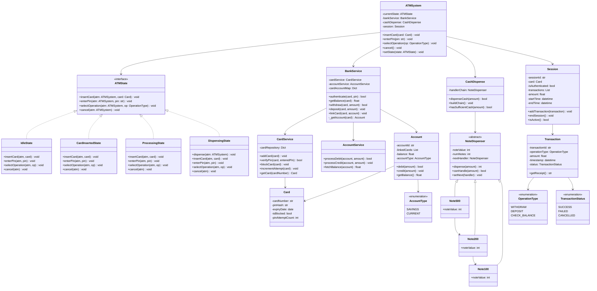
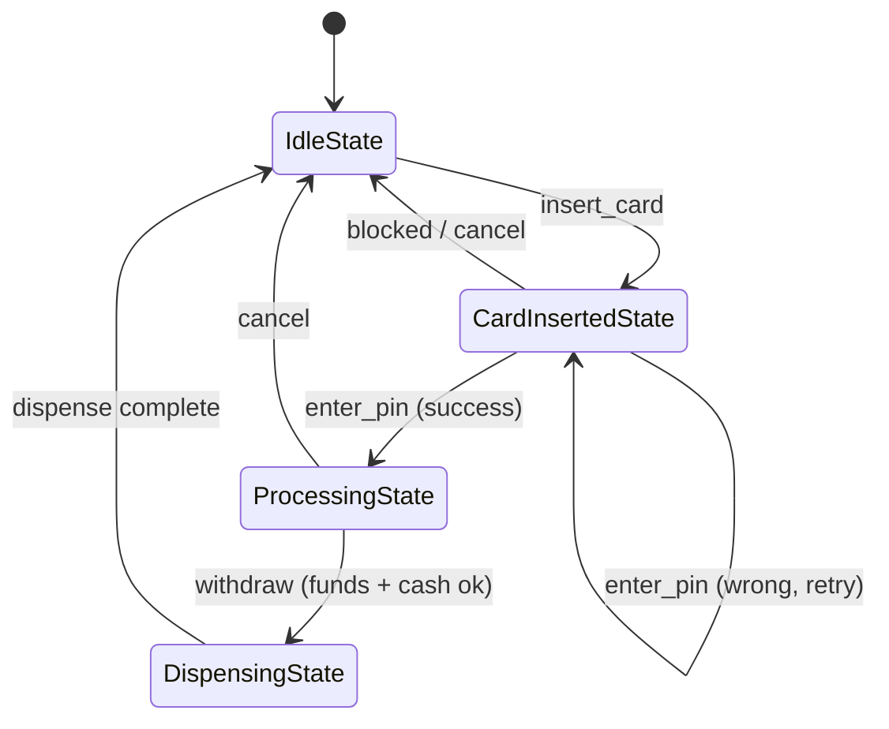

# ATM Machine — Low Level Design (Python)

A console simulation of an ATM built to practice OOP and design patterns. The
system authenticates a card, runs operations (withdraw / deposit / balance),
and dispenses cash — modeled with three classic patterns.

## Design Patterns Used

| Pattern | Where | Why |
|---|---|---|
| **State** | `states/` — `IdleState`, `CardInsertedState`, `ProcessingState`, `DispensingState` | The ATM behaves differently per state; each state owns its valid actions and decides the next state. No giant `if status == ...` blocks in the controller. |
| **Facade** | `services/BankService` | Hides `CardService` + `AccountService` behind one simple API and owns the `card -> account` resolution. |
| **Chain of Responsibility** | `cash/` — `Note500 -> Note200 -> Note100` | Each denomination handler dispenses what it can and forwards the remainder down the chain. |

## Architecture (Layers)

```
constants/   Enums         OperationType, TransactionStatus, AccountType
models/      Entities      Card, Account, Session, Transaction
services/    Logic         CardService, AccountService, BankService (Facade)
states/      State machine ATMState (ABC) + Idle/CardInserted/Processing/Dispensing
cash/        CoR chain     NoteDispenser (ABC) + Note500/200/100 + CashDispense
atm.py       Controller    ATMSystem (State-pattern Context)
main.py      Entry point   Wires everything + runs 3 scenarios
```

## Class Diagram



## State Transitions



## How to Run

Run from inside the `atm/` directory (modules use top-level package imports):

```bash
cd atm
python main.py
```

## Demo Scenarios (in `main.py`)

- **Scenario A** — wrong PIN entered 3 times → card auto-blocks; even the
  correct PIN is then rejected.
- **Scenario B** — fresh card withdraws **1300** → dispensed as
  `2 x 500 + 1 x 200 + 1 x 100`; balance 10000 → 8700.
- **Scenario C** — withdrawal beyond available funds/cash → fails gracefully
  with **no debit**; card ejected.

> Note: cash availability is checked **before** the account is debited, so the
> ATM never takes money it cannot physically dispense.

## Notes / Possible Extensions

- The cash dispenser is **greedy**, so it can miss valid combinations when
  larger notes run out (the classic limited-coin-change problem). A
  DP/backtracking dispenser would handle every feasible breakdown.
- `Transaction.get_receipt()` currently prints the enum's repr
  (`OperationType.WITHDRAW`); use `.value` for a cleaner receipt.
- Deposit and a full transaction history per session are modeled but only
  lightly exercised by the demo.
```
