# Parking Lot System - Low Level Design

A comprehensive object-oriented parking lot management system implemented in C++, demonstrating industry-standard design patterns and SOLID principles.

## 📋 Table of Contents

- [Overview](#overview)
- [Design Patterns](#design-patterns)
- [Class Diagram](#class-diagram)
- [Class Descriptions](#class-descriptions)
- [Relationships](#relationships)
- [Features](#features)
- [How to Run](#how-to-run)
- [System Workflow](#system-workflow)

---

## 🎯 Overview

This parking lot system manages:
- **Multiple vehicle types** (Car, Truck, Bike, ElectricCar)
- **Multiple spot types** (Compact, Large, Bike, Handicapped, Electric)
- **Flexible parking strategies** (Nearest-first, Best-fit, Farthest-first)
- **Flexible fee calculation** (Hourly flat rate, Vehicle-based pricing)
- **Reservation system** with time-based validity
- **Payment processing** with receipt generation
- **Multi-floor support** with real-time availability tracking

---

## 🏗️ Design Patterns

### 1. **Singleton Pattern**
- **Class**: `ParkingLot`
- **Purpose**: Ensures only one parking lot instance exists
- **Implementation**: Thread-safe double-checked locking

### 2. **Strategy Pattern** (×2)
- **Classes**: `ParkingStrategy`, `FeeStrategy`
- **Purpose**:
  - `ParkingStrategy`: Switch between different spot selection algorithms at runtime
  - `FeeStrategy`: Switch between different pricing models at runtime
- **Implementations**:
  - Parking: `NearestFirstStrategy`, `BestFitStrategy`, `FarthestFirstStrategy`
  - Fee: `HourlyFeeStrategy`, `VehicleBasedFeeStrategy`

### 3. **Inheritance & Polymorphism**
- **Vehicle Hierarchy**: `Vehicle` → `Car`, `Truck`, `Bike`, `ElectricCar`
- **ParkingSpot Hierarchy**: `ParkingSpot` → `CompactSpot`, `LargeSpot`, `BikeSpot`, `HandicappedSpot`, `ElectricSpot`
- **Purpose**: Support extensibility for new vehicle/spot types

---

## 📊 Class Diagram

```mermaid
classDiagram
    %% ==================== VEHICLE HIERARCHY ====================
    class Vehicle {
        <<abstract>>
        #string licenseNumber
        +isSmallSized()* bool
        +isMediumSized()* bool
        +isLargeSized()* bool
        +requiresCharging()* bool
        +getVehicleCategory()* string
        +getLicenseNumber() string
    }

    class Car {
        +isSmallSized() bool
        +isMediumSized() bool
        +isLargeSized() bool
        +requiresCharging() bool
        +getVehicleCategory() string
    }

    class Truck {
        +isSmallSized() bool
        +isMediumSized() bool
        +isLargeSized() bool
        +requiresCharging() bool
        +getVehicleCategory() string
    }

    class Bike {
        +isSmallSized() bool
        +isMediumSized() bool
        +isLargeSized() bool
        +requiresCharging() bool
        +getVehicleCategory() string
    }

    class ElectricCar {
        +isSmallSized() bool
        +isMediumSized() bool
        +isLargeSized() bool
        +requiresCharging() bool
        +getVehicleCategory() string
    }

    Vehicle <|-- Car : Inheritance
    Vehicle <|-- Truck : Inheritance
    Vehicle <|-- Bike : Inheritance
    Vehicle <|-- ElectricCar : Inheritance

    %% ==================== PARKING SPOT HIERARCHY ====================
    class ParkingSpot {
        <<abstract>>
        #string spotId
        #bool isOccupied
        #int floorNumber
        #double distanceFromEntry
        #bool isReserved
        #Vehicle* vehicle
        +canFitVehicle(Vehicle*)* bool
        +getSpotCategory()* string
        +park(Vehicle*) bool
        +unpark() Vehicle*
        +isAvailable() bool
        +reserve()
        +unreserve()
    }

    class CompactSpot {
        +canFitVehicle(Vehicle*) bool
        +getSpotCategory() string
    }

    class LargeSpot {
        +canFitVehicle(Vehicle*) bool
        +getSpotCategory() string
    }

    class BikeSpot {
        +canFitVehicle(Vehicle*) bool
        +getSpotCategory() string
    }

    class HandicappedSpot {
        +canFitVehicle(Vehicle*) bool
        +getSpotCategory() string
    }

    class ElectricSpot {
        +canFitVehicle(Vehicle*) bool
        +getSpotCategory() string
    }

    ParkingSpot <|-- CompactSpot : Inheritance
    ParkingSpot <|-- LargeSpot : Inheritance
    ParkingSpot <|-- BikeSpot : Inheritance
    ParkingSpot <|-- HandicappedSpot : Inheritance
    ParkingSpot <|-- ElectricSpot : Inheritance
    ParkingSpot o-- Vehicle : Association

    %% ==================== PARKING STRATEGY (STRATEGY PATTERN) ====================
    class ParkingStrategy {
        <<interface>>
        +findSpot(vector~ParkingSpot*~, Vehicle*)* ParkingSpot*
        +getName()* string
    }

    class NearestFirstStrategy {
        +findSpot(vector~ParkingSpot*~, Vehicle*) ParkingSpot*
        +getName() string
    }

    class BestFitStrategy {
        -getSpotScore(string) int
        +findSpot(vector~ParkingSpot*~, Vehicle*) ParkingSpot*
        +getName() string
    }

    class FarthestFirstStrategy {
        +findSpot(vector~ParkingSpot*~, Vehicle*) ParkingSpot*
        +getName() string
    }

    ParkingStrategy <|-- NearestFirstStrategy : Inheritance
    ParkingStrategy <|-- BestFitStrategy : Inheritance
    ParkingStrategy <|-- FarthestFirstStrategy : Inheritance

    %% ==================== FEE STRATEGY (STRATEGY PATTERN) ====================
    class FeeStrategy {
        <<interface>>
        +calculateFee(ParkingTicket*)* double
        +getName()* string
    }

    class HourlyFeeStrategy {
        -double ratePerHour
        +calculateFee(ParkingTicket*) double
        +getName() string
    }

    class VehicleBasedFeeStrategy {
        -map~string,PricingTier~ pricing
        -double chargingFee
        +calculateFee(ParkingTicket*) double
        +getName() string
    }

    FeeStrategy <|-- HourlyFeeStrategy : Inheritance
    FeeStrategy <|-- VehicleBasedFeeStrategy : Inheritance

    %% ==================== CORE SYSTEM CLASSES ====================
    class ParkingTicket {
        -static int ticketCounter
        -int ticketId
        -Vehicle* vehicle
        -ParkingSpot* spot
        -time_t entryTime
        -time_t exitTime
        -bool isActive
        +markExit()
        +getDurationInHours() double
        +printTicket()
    }

    class Payment {
        -static int paymentCounter
        -int paymentId
        -double amount
        -string paymentMethod
        -string paymentStatus
        -time_t paymentTime
        -ParkingTicket* ticket
        +processPayment() bool
        +printReceipt()
    }

    class Reservation {
        -static int reservationCounter
        -int reservationId
        -Vehicle* vehicle
        -ParkingSpot* spot
        -time_t reservedFrom
        -time_t reservedTo
        -string status
        +isExpired() bool
        +isValid() bool
        +complete()
        +cancel()
    }

    class Floor {
        -int floorNumber
        -vector~ParkingSpot*~ allSpots
        +addSpot(ParkingSpot*)
        +getAllAvailableSpots() vector~ParkingSpot*~
        +getTotalAvailableSpots() int
        +displayStatus()
    }

    class EntryPanel {
        -static int panelCounter
        -int panelId
        -Floor* floor
    }

    class ExitPanel {
        -static int panelCounter
        -int panelId
        -Floor* floor
    }

    class ParkingLot {
        <<Singleton>>
        -static ParkingLot* instance
        -static mutex mtx
        -vector~Floor*~ floors
        -vector~EntryPanel*~ entryPanels
        -vector~ExitPanel*~ exitPanels
        -map~int,ParkingTicket*~ activeTickets
        -map~int,Reservation*~ activeReservations
        -ParkingStrategy* parkingStrategy
        -FeeStrategy* feeStrategy
        -double totalRevenue
        -ParkingLot()
        +getInstance()$ ParkingLot*
        +addFloor(Floor*)
        +addEntryPanel(EntryPanel*)
        +addExitPanel(ExitPanel*)
        +setParkingStrategy(ParkingStrategy*)
        +setFeeStrategy(FeeStrategy*)
        +reserveSpot(Vehicle*, int) Reservation*
        +cancelReservation(int) bool
        +parkVehicle(Vehicle*, int) ParkingTicket*
        +unparkVehicle(int, string) Payment*
        +displayStatus()
        +isFull() bool
        +getTotalRevenue() double
    }

    %% ==================== RELATIONSHIPS ====================
    ParkingTicket o-- Vehicle : Association
    ParkingTicket o-- ParkingSpot : Association
    Payment o-- ParkingTicket : Association
    Reservation o-- Vehicle : Association
    Reservation o-- ParkingSpot : Association
    Floor *-- ParkingSpot : Composition
    EntryPanel o-- Floor : Association
    ExitPanel o-- Floor : Association
    ParkingLot *-- Floor : Composition
    ParkingLot *-- EntryPanel : Composition
    ParkingLot *-- ExitPanel : Composition
    ParkingLot o-- ParkingTicket : Association (manages)
    ParkingLot o-- Reservation : Association (manages)
    ParkingLot o-- ParkingStrategy : Association (uses)
    ParkingLot o-- FeeStrategy : Association (uses)
    FeeStrategy ..> ParkingTicket : Dependency
```



---

## 📚 Class Descriptions

### **Vehicle Hierarchy**

| Class | Size | Charging | Can Park In |
|-------|------|----------|-------------|
| `Bike` | Small | No | BikeSpot, CompactSpot, LargeSpot |
| `Car` | Medium | No | CompactSpot, HandicappedSpot, LargeSpot |
| `Truck` | Large | No | LargeSpot only |
| `ElectricCar` | Medium | Yes | ElectricSpot only |

### **ParkingSpot Hierarchy**

| Spot Type | Accepts | Purpose |
|-----------|---------|---------|
| `BikeSpot` | Bikes only | Small vehicle parking |
| `CompactSpot` | Bikes, Cars | Space-efficient spots |
| `HandicappedSpot` | Cars only | Accessible parking |
| `ElectricSpot` | Electric vehicles | Charging facility |
| `LargeSpot` | All non-electric | Flexible large spaces |

### **Parking Strategies**

| Strategy | Algorithm | Use Case |
|----------|-----------|----------|
| `NearestFirstStrategy` | Finds closest spot to entry | Customer convenience |
| `BestFitStrategy` | Finds most restrictive fitting spot | Space optimization |
| `FarthestFirstStrategy` | Finds farthest spot from entry | Keep entry spots available |

### **Fee Strategies**

| Strategy | Pricing Model | Description |
|----------|---------------|-------------|
| `HourlyFeeStrategy` | Flat rate × hours | Same price for all vehicles |
| `VehicleBasedFeeStrategy` | Base + hourly rate by size | Bikes cheaper, trucks more expensive |

### **Core System Classes**

- **`ParkingLot`** (Singleton): Central controller, manages all operations
- **`Floor`** (Composition): Owns and manages multiple parking spots
- **`ParkingTicket`**: Links vehicle to spot, tracks time for billing
- **`Reservation`**: Pre-books a spot for a time window
- **`Payment`**: Processes payment and generates receipt
- **`EntryPanel`/`ExitPanel`**: Entry and exit points (extensible)

---

## 🔗 Relationships

### **Inheritance** (IS-A)
```
Vehicle
  ├── Car
  ├── Truck
  ├── Bike
  └── ElectricCar

ParkingSpot
  ├── CompactSpot
  ├── LargeSpot
  ├── BikeSpot
  ├── HandicappedSpot
  └── ElectricSpot

ParkingStrategy
  ├── NearestFirstStrategy
  ├── BestFitStrategy
  └── FarthestFirstStrategy

FeeStrategy
  ├── HourlyFeeStrategy
  └── VehicleBasedFeeStrategy
```

### **Composition** (OWNS, strong lifecycle dependency)
- `Floor` **owns** `ParkingSpot` objects (Floor creates/destroys spots)
- `ParkingLot` **owns** `Floor`, `EntryPanel`, `ExitPanel` objects

### **Association** (HAS-A, weak relationship)
- `ParkingSpot` **references** `Vehicle` (when occupied)
- `ParkingTicket` **references** `Vehicle` and `ParkingSpot`
- `Reservation` **references** `Vehicle` and `ParkingSpot`
- `Payment` **references** `ParkingTicket`
- `ParkingLot` **manages** active `ParkingTicket` and `Reservation` objects
- `ParkingLot` **uses** `ParkingStrategy` and `FeeStrategy` (Strategy Pattern)

### **Dependency** (USES)
- `FeeStrategy` **depends on** `ParkingTicket` for fee calculation

---

## ✨ Features

✅ **Multi-vehicle support** - Cars, Trucks, Bikes, Electric Vehicles
✅ **Multi-spot types** - Compact, Large, Bike, Handicapped, Electric
✅ **Flexible parking algorithms** - Nearest, Best-fit, Farthest (Strategy Pattern)
✅ **Dynamic fee calculation** - Hourly or vehicle-based (Strategy Pattern)
✅ **Reservation system** - Pre-book spots with time-based validity
✅ **Thread-safe singleton** - Only one parking lot instance
✅ **Multi-floor support** - Scalable to multiple floors
✅ **Real-time status tracking** - View availability and revenue
✅ **Payment processing** - Receipt generation

---

## 🚀 How to Run

### **Compilation**

```bash
cd parking-lot/cpp
g++ -std=c++11 main.cpp -o parking_system
```

### **Execution**

```bash
./parking_system
```

### **Expected Output**

The system demonstrates:
1. ✅ Setting up a 2-floor parking lot with 6 spots
2. ✅ Parking vehicles with **NearestFirstStrategy**
3. ✅ Switching to **BestFitStrategy** at runtime
4. ✅ Creating and using **reservations**
5. ✅ Processing payments with **HourlyFeeStrategy**
6. ✅ Switching to **VehicleBasedFeeStrategy** (trucks pay more)
7. ✅ Final revenue calculation

---

## 🔄 System Workflow

### **1. Parking a Vehicle (without reservation)**

```
Customer arrives → ParkingLot.parkVehicle(vehicle)
  → Collects all available spots from all floors
  → Uses ParkingStrategy.findSpot() to select best spot
  → Spot.park(vehicle) marks spot as occupied
  → Creates and returns ParkingTicket
```

### **2. Parking with Reservation**

```
Advance booking → ParkingLot.reserveSpot(vehicle, hours)
  → Finds suitable spot using strategy
  → Creates Reservation, marks spot as reserved

Customer arrives → ParkingLot.parkVehicle(vehicle, reservationId)
  → Validates reservation (not expired, still active)
  → Uses pre-reserved spot
  → Completes reservation
```

### **3. Unparking and Payment**

```
Customer exits → ParkingLot.unparkVehicle(ticketId, paymentMethod)
  → Ticket.markExit() records exit time
  → FeeStrategy.calculateFee(ticket) computes charge
  → Payment.processPayment() processes transaction
  → Spot.unpark() frees the spot
  → Returns Payment with receipt
```

---

## 📖 Design Principles Applied

- **Single Responsibility Principle**: Each class has one clear purpose
- **Open/Closed Principle**: Extensible via Strategy Pattern, new strategies can be added without modifying existing code
- **Liskov Substitution Principle**: All vehicle/spot subtypes are interchangeable
- **Interface Segregation**: Strategy interfaces are focused and minimal
- **Dependency Inversion**: ParkingLot depends on abstractions (ParkingStrategy, FeeStrategy) not concrete implementations

---

## 🎓 Learning Points

This design demonstrates:
- ✅ **Strategy Pattern** for runtime algorithm selection
- ✅ **Singleton Pattern** with thread safety
- ✅ **Polymorphism** for extensibility
- ✅ **Composition over Inheritance** (Floor owns ParkingSpots)
- ✅ **Association vs Composition** understanding
- ✅ **SOLID principles** in practice
- ✅ **Real-world system design** with business logic

---

## 📝 File Structure

```
parking-lot/cpp/
├── Vehicle.h           # Vehicle hierarchy (Car, Truck, Bike, ElectricCar)
├── ParkingSpot.h       # ParkingSpot hierarchy (5 spot types)
├── ParkingStrategy.h   # Strategy pattern for parking algorithms
├── FeeStrategy.h       # Strategy pattern for fee calculation
├── ParkingTicket.h     # Ticket issued when parking
├── Payment.h           # Payment processing
├── Reservation.h       # Advance booking system
├── Floor.h             # Floor management
├── Panel.h             # Entry/Exit panels
├── ParkingLot.h        # Main system controller (Singleton)
├── main.cpp            # Test scenarios
└── README.md           # This file
```

---

**Author**: Generated for Low-Level Design practice
**Language**: C++11
**Design Level**: Low-Level Design (LLD)
**Patterns**: Singleton, Strategy, Inheritance, Composition, Association
