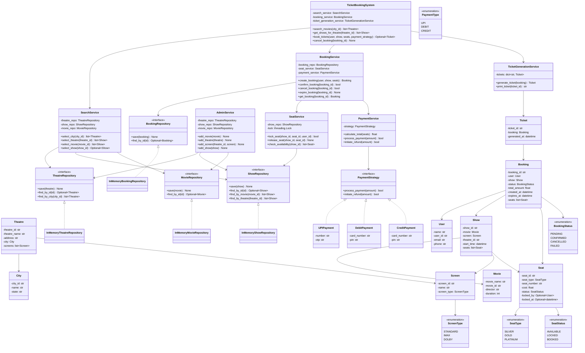

# Movie Ticket Booking System (BookMyShow) — LLD Revision Sheet

> Single-file quick-revision doc. Read top-to-bottom before an interview.
> Status: **COMPLETE** — all entities, repos, services, payment strategies, facade, and `main.py` implemented and tested.

---

## 1. Problem Statement
Design a movie ticket booking system like BookMyShow.
- Multiple movies across multiple theatres in a city; each theatre has screens; each screen has seats.
- Seat types — Silver / Gold / Platinum — different prices.
- User: search movies by city → select show → select seats → book → pay.
- **Payment must complete within 10 minutes** of seat selection, else seats release.
- **Two users cannot book the same seat for the same show** (no double-booking).
- Booking can be cancelled and refunded.
- Admin can add movies, theatres, screens, shows.

---

## 2. Patterns Used (know one line on each)
| Pattern | Where | Why |
|---------|-------|-----|
| **Strategy** | `PaymentStrategy` → UPI / Debit / Credit | Add a payment method with zero changes to `PaymentService` (Open/Closed) |
| **Facade** | `TicketBookingSystem` | One entry point hides the whole subsystem; `book_tickets` sequences create→pay→confirm→ticket |
| **Repository** | `*Repository` (ABC) + `InMemory*` | Hide storage behind a collection-like API; services depend on the abstraction (DIP) |
| **(v2) State** | Booking lifecycle | Planned refactor of status guards into `BookingState` classes |

---

## 3. Architecture (layers, dependencies point downward)
```
main.py  (Composition Root — wires everything)
   │
TicketBookingSystem  (Facade)
   │
Services:  Search · Admin · Seat · Payment · Booking · TicketGeneration
   │
Repositories (ABC) ──> InMemory* (dict storage)
   │
Entities (dataclasses)  +  Enums
```
**Rule:** Services own LOGIC, Repositories own STORAGE, Entities are dumb data, the Facade orchestrates.

---

## 4. Layer-by-layer summary

### Enums (`enums/enums.py`)
`BookingStatus` {PENDING, CONFIRMED, CANCELLED, FAILED} · `SeatType` {SILVER, GOLD, PLATINUM} · `SeatStatus` {AVAILABLE, LOCKED, BOOKED} · `ScreenType` {STANDARD, IMAX, DOLBY} · `PaymentType` {UPI, DEBIT, CREDIT}. All inherit `Enum`.

### Entities (`entities/`) — all `@dataclass`
- Required fields first, defaulted fields last (dataclass rule).
- Mutable defaults via `field(default_factory=list)`, never `= []`.
- `Seat` defaults: `status=AVAILABLE`, `locked_by=None`, `locked_at=None`.
- `Show` carries a **denormalized `theatre_id`** (so `find_by_theatre` is a simple lookup).

### Repositories (`repositories/`) — one per **aggregate root**
- `Theatre`, `Show`, `Movie`, `Booking` get repos. **`Screen`/`Seat`/`City` do NOT** (owned children).
- Each: ABC interface + `InMemory*` (`dict[str, Entity]`).
- `save` = upsert by id; `find_by_id` → `Optional`; multi-result finders return `list`.
- `TheatreRepository.find_by_city` · `ShowRepository.find_by_theatre` / `find_by_movie`.

### Services (`service/`)
- **SearchService** — pure delegation to repos (queries return values).
- **AdminService** — `add_movie/theatre/screen/show`; commands return `None`; `add_screen(theatre_id, screen)` does find→append→save on the Theatre aggregate; guards missing theatre.
- **SeatService** — **concurrency core**. Holds `threading.Lock`. `lock_seat`/`release_seat`/`check_availability`, all take `show_id` (seats live inside shows).
- **PaymentService** — holds a `PaymentStrategy`; `calculate_total(seats)`, delegates `process_payment`/`initiate_refund`.
- **BookingService** — orchestrates create (lock-all-or-rollback) / confirm / cancel (+refund) / expire / get.
- **TicketGenerationService** — `dict[str, Ticket]`; only generates for CONFIRMED bookings.

### Facade (`service/ticket_booking_service.py`)
`TicketBookingSystem`: `search_movies`, `get_shows_for_theatre`, `book_tickets` (full flow, rolls back booking on payment failure), `cancel_booking`.

---

## 5. Critical Design Decisions (defend these)
1. **Pessimistic seat locking.** Seat → LOCKED on selection, freed on cancel/timeout. Seats are scarce; double-booking is unacceptable.
2. **The lock arbitrates the race; the timestamp arbitrates expiry.** `threading.Lock` decides *who wins* (first thread in). `locked_at` is ONLY for the 10-min timeout, measured on the server's single clock — never compare client clocks to pick a winner.
3. **Atomic check-then-set.** `if status == AVAILABLE: set LOCKED` must be inside one `with self._lock:` block, or two readers both see AVAILABLE and double-book.
4. **One repository per aggregate root.** Children (`Screen`, `Seat`) are persisted inside their root; no orphan repos.
5. **All-or-nothing booking.** If any seat fails to lock, release only the seats *we* locked (tracked in a `locked` list) — never release the failed seat (it's someone else's).
6. **Payment failure rolls the booking back.** Facade cancels the booking on failed payment so locked seats don't leak until expiry.
7. **`release_seat` frees LOCKED or BOOKED.** Cancel of a CONFIRMED booking (seats BOOKED) must still free seats.
8. **Strategy details in the constructor, uniform method signature.** `UPIPayment(upi_id)` vs `CreditPayment(card, cvv)` — different `__init__`, same `process_payment(amount)`. Keeps `PaymentService` decoupled.

---

## 6. Key flows

**Booking (`book_tickets`):**
```
create_booking  →  lock every seat (rollback own locks if any fails)
                   build PENDING booking (created_at, expires_at = now+10m), save
process_payment →  via chosen strategy
   ├─ fail → cancel_booking (release seats) → return None
   └─ ok   → confirm_booking (seats LOCKED→BOOKED, status→CONFIRMED)
                generate_ticket → print
```

**Expiry (`expire_booking`):** if `status==PENDING and now > expires_at` → release seats → status `FAILED`.

**Concurrency guarantee (tested):** 50 threads racing one seat → exactly 1 winner, 49 losers.

---

## 7. Completed Class Diagram



---

## 8. `main.py` simulation (7 steps)
1. Admin adds movie, theatre, screen, show (seats attached to show).
2. User searches by city → theatres → shows.
3. User 1 locks 2 seats, pays (UPI) → ticket issued.
4. Verify seats → BOOKED, availability shrinks.
5. User 2 tries same seats → `book_tickets` returns `None` (unavailable).
6. User 1 cancels → refund + seats freed → User 2 books them.
7. Expiry: create PENDING booking, force `expires_at` to the past, `expire_booking` → seat freed, status FAILED.

Run: `python main.py`

---

## 9. Known trade-offs / v2 ideas (mention proactively)
- **Single global lock** in `SeatService` (simple, but serializes all seat ops). v2: per-seat / per-show locks for throughput.
- **`calculate_total` lives in PaymentService** but is strategy-independent → BookingService ends up needing its own PaymentService just for totals. v2: move totalling out, or have BookingService compute it.
- **Status guards instead of State pattern.** v2: `BookingState` classes (PENDING/CONFIRMED/...) encapsulating allowed transitions.
- **No real expiry scheduler.** v2: background thread / scheduled job to auto-call `expire_booking`.
- **Cosmetic:** `CreditPayment` prints "debit card"; `PaymentService.initiate_refund` param naming.
```
